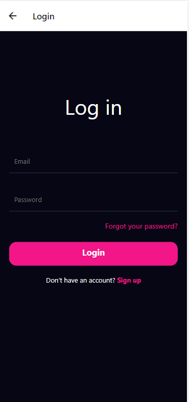
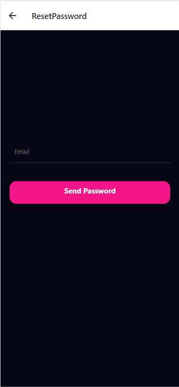
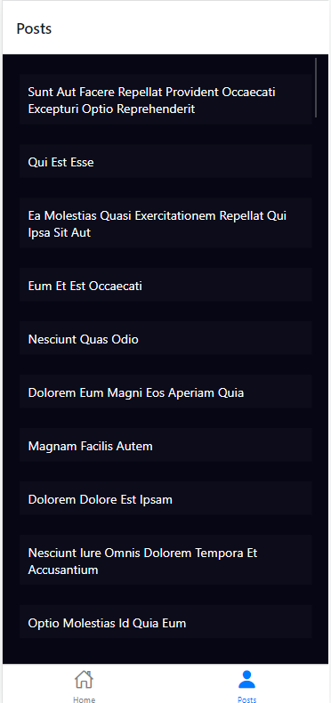

# ReactNativeApp
Firebase ve React Native kullanarak giriş, şifremi unuttum, kayıt ol, ana sayfa ve "https://jsonplaceholder.typicode.com/posts" adresinden aldığım postların olduğu sayfalar oluşturdum.







-ReactNative

-axios

-Firebase

-https://jsonplaceholder.typicode.com/posts

## Kurulum

```sh
git clone https://github.com/senemdemirr/ReactNativeApp.git
cd mobileApp
npm i
expo start
```

## Dosya Yapısı

```
.mobileApp
├─ expo
├─ expo-shared
├─ assets
├─ node-modules
├─ src
 |      ├─ config
 |       |      └─ colors.js
 |      ├─ navigations
 |       |      └─ TabMenu.js
 |      ├─ screens
 |       |      ├─ Home.js
 |       |      ├─ index.js
 |       |      ├─ Login.js
 |       |      ├─ Main.js
 |       |      ├─ Posts.js
 |       |      ├─ Register.js
 |       |      └─ ResetPassword.js
 |      └─ services
├─ App.js
├─ app.json
├─ babel.config.js
├─ firebase-config.js
├─ firebase-origin.js
├─ package-lock.json
└─ package.json

```
